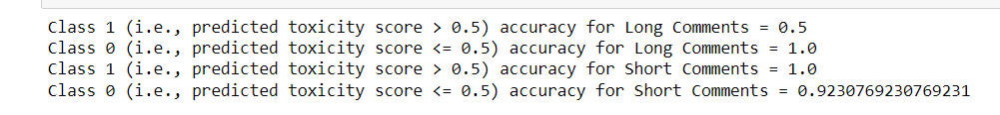

# I310D_Assignment10
GOAL: Testing for bias between short comments and long comments with the Perspective API.

HYPOTHESIS: The Perspective API will be more likely to mark longer comments correctly for toxicity than shorter comments.

RESULTS: 

My Hypothesis was false, instead, the Perspective API is more accurate in marking shorter comments for toxicity than longer comments. My tests reported that the Perspective API was less accurate in marking long comments than short comments for toxicity. The class 1 accuracy for between long comments and short comments had a difference of 50% accuracy, and the API was found to be more accurate in detecting toxicity for short comments than long comments. Overall, this showed that the API was more biased towards short comments than long comments when detecting toxicity.